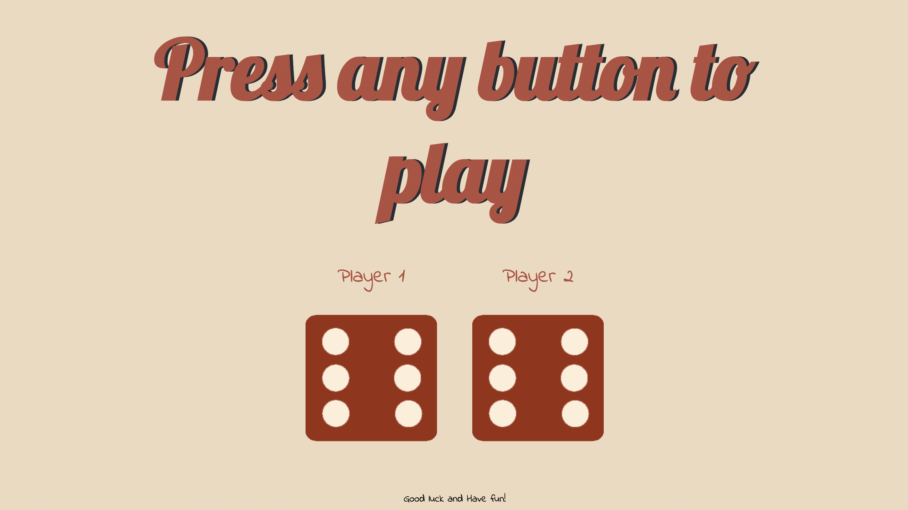

# DiceGame
The website created for Dice game using HTML/CSS/JS. 

To start the game, press any button. It will be detected by index.js and start the game. 

Dice numbers generated randomly using Math.random function. Later, depending on who has the higher numbers, h1 tag will show the game result on the screen:
Player 1 wins / Player 2 wins / Draw

